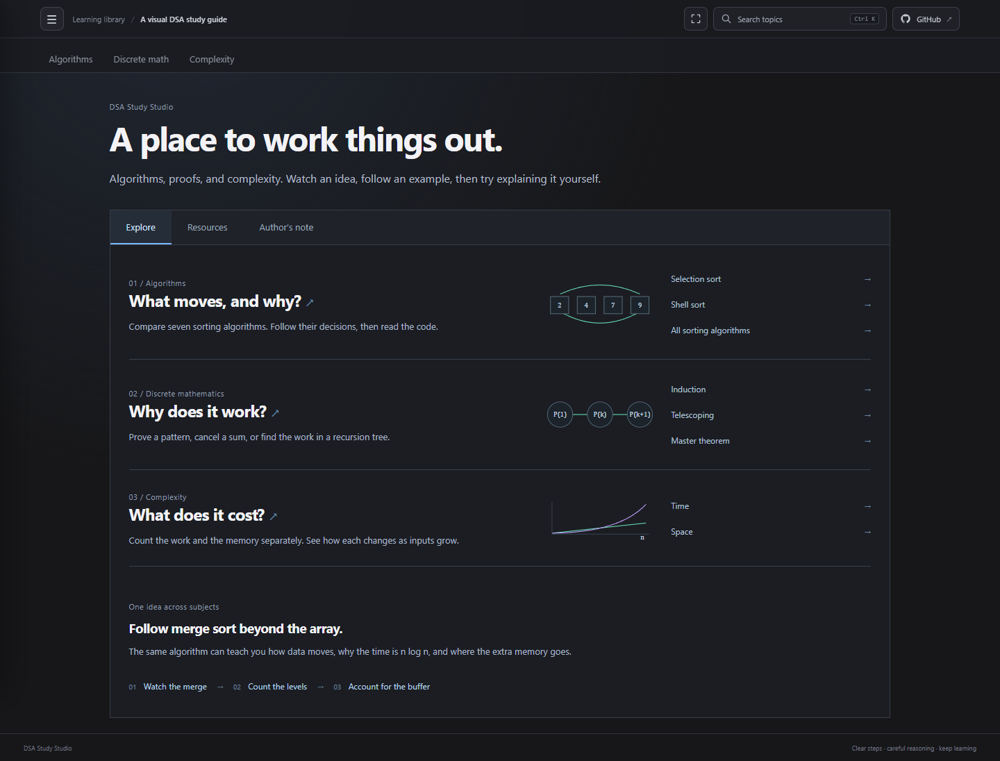

<div align="center">

# Algorithm Visual Learning

**A visual study guide for understanding algorithms, discrete mathematics, and complexity.**

[](https://ba-calderonmorales.github.io/algorithm-visual-learning/)
[](https://github.com/BA-CalderonMorales/algorithm-visual-learning/actions)



</div>

## Quick Start

```bash
npm ci
npm run dev
```

Open the local URL printed by Vite. To verify the production build:

```bash
npm run build
```

Before publishing, check the rendered walkthroughs in a browser:

```bash
npx playwright install chromium
npm run test:walkthroughs
```

These checks cover every sorting walkthrough at desktop, tablet, and phone widths, including navigation, reloads, animations, and recovery from a failed load. They run against development and the production preview; GitHub Pages deployment waits for them to pass.

## Publish to GitHub Pages

Publishing is automatic: push or merge changes to `develop`. The Pages workflow builds the site and deploys it. Check the [Actions runs](https://github.com/BA-CalderonMorales/algorithm-visual-learning/actions) for the result; the live site updates after a successful run.

To deploy the current `develop` branch again without a new change, open **Actions → Build and publish Sorting Walkthroughs → Run workflow**. GitHub Pages should use **GitHub Actions** as its source under **Settings → Pages**. No release tag is needed for a site deployment.

Exported videos are cached between deployments. Each film is checked against its scene data, shared renderer, capture code, dependencies, and file checksum. Missing, changed, or damaged videos are regenerated; narration and site-only edits reuse unchanged films. A cold or expired cache still needs a full render. The build and walkthrough checks always run.

Use `npm run test:film-cache` to check cache invalidation and `npm run test:film-rendering` for a short browser recording test (with the dev server running). To deliberately re-record a film locally, run `npm run render:films -- --force selection`.

## Project Layout

```text
src/                    # Feature-owned presentation, view-models, and pure models
docs/adr/               # Accepted architecture decisions
public/walkthroughs/    # walkthroughs plus simple/typed Python, JS, and TS examples
public/study-mark.svg   # site favicon
.github/workflows/      # GitHub Pages build and deployment
```

The walkthrough pages are standalone HTML so they also work independently. Tim Sort's Python file is an educational implementation, not CPython's production sort.

See [the source map](src/README.md) and [ADR 0001](docs/adr/0001-feature-owned-mvvm-and-styles.md) before contributing. Views use one colocated CSS module; reactive behavior belongs in `.svelte.ts` view-models and pure rules in models. Hand-maintained source files stay at 500 lines or fewer. `npm run test:architecture` and `npm run format:check` enforce the key boundaries before deployment.

Each algorithm page starts with a plain Python version for learning the core idea, then offers typed Python, JavaScript, and TypeScript examples. These are teaching references; some, including Tim Sort, intentionally favor clarity over production-level optimizations.

## Recorded narration

Sorting Play tabs offer optional Echo narration, loaded one scene at a time. Students need no speech service or API key. To regenerate the recordings locally with Lemonade, see [the narration guide](public/narration/echo/README.md).

## Contributing

This project is designed to be forked, adapted for future classes, and improved by students. See [CONTRIBUTING.md](CONTRIBUTING.md) for the small local workflow and teaching-focused guidelines, and [CONTRIBUTORS.md](CONTRIBUTORS.md) for attribution. The project is licensed under the [MIT License](LICENSE).
